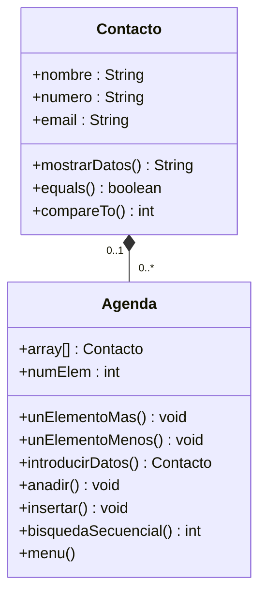
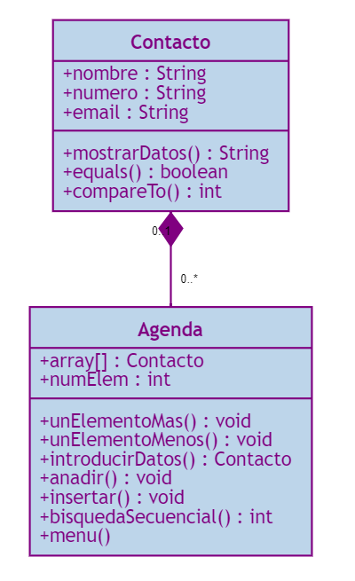

#Ejercicio 5
---
Para esta práctica hemos realizado este archivo para comentar el archivo java sobre el que hemos trabajado.
Utilizo mermaid para 

```mermaid
classDiagram
    Contacto "0..1"*--"0..*" Agenda


    class Agenda{
      +array[] : Contacto
      +numElem : int
      +unElementoMas() void
      +unElementoMenos() void
      +introducirDatos() Contacto
      +anadir() void
      +insertar() void
      +bisquedaSecuencial() int
      +menu()
    }

    class Contacto{
        +nombre : String
        +numero : String
        +email : String
        +mostrarDatos() String
        +equals() boolean
        +compareTo() int
    }

```
